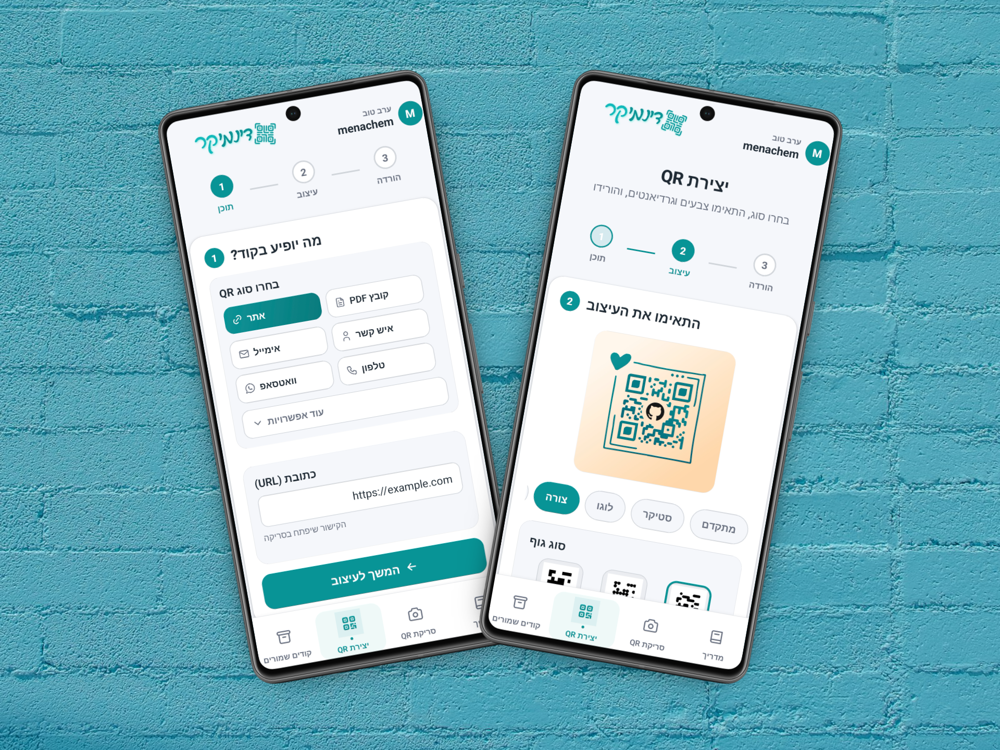
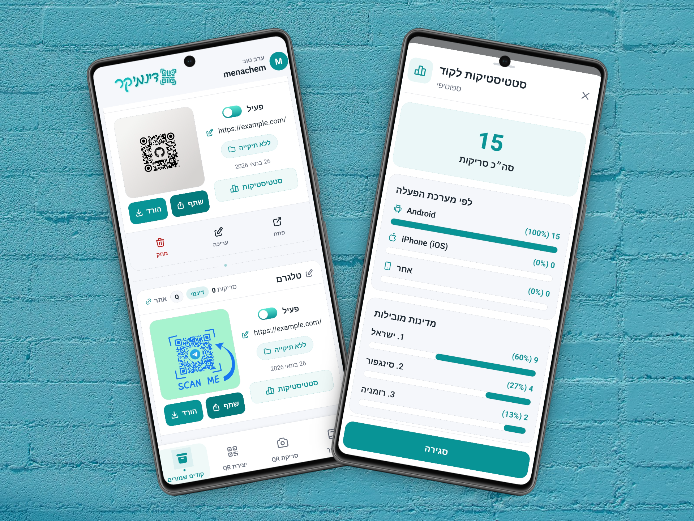

<div dir="rtl" align="right">

<h1 align="center">DynamiQR — Android</h1>

אפליקציית Android מקורית (Java) ליצירה, עיצוב, שמירה וסריקה של קודי QR — סטטיים ודינמיים — עם ממשק בעברית ובאנגלית.

התמונות של ה־QR נוצרות בשרת DynamiQR; האפליקציה היא לקוח Native שמתחבר לאותו Backend.

**Backend:** [Menmen770/DynamiQR](https://github.com/Menmen770/DynamiQR) (`backend/`)

---

## צילומי מסך

<p align="center">
  
  &nbsp;&nbsp;&nbsp;
  
</p>

<p align="center">
  <sub>יצירת QR · קודים שמורים</sub>
</p>

---

## יכולות

| מסך | תיאור |
| --- | --- |
| קודים שמורים | רשימה, תיקיות, סטטיסטיקות (דינמי), עריכה ומחיקה |
| יצירת QR | תוכן ← עיצוב ← ייצוא / שמירה לחשבון |
| סריקה | מצלמה + פתיחת קישור |
| מדריך | הסבר קצר על שימושי QR |
| חשבון | פרופיל, שפה, מצב כהה, מחיקת חשבון |

---

## אחסון נתונים — Room ו־MongoDB

| שכבה | מיקום | מה נשמר |
| --- | --- | --- |
| **Room** | במכשיר בלבד | פרופיל קורס: ת.ז., טלפון, תאריך לידה (+ שם / אימייל מקומי) |
| **MongoDB** | שרת DynamiQR | משתמשים (JWT), קודי QR שמורים, סטטיסטיקות, תיקיות |

הרשמה והתחברות עוברות דרך ה־API (Mongo). שדות הקורס נשמרים ב־Room בנפרד, בלי שינוי לסכמת השרת.

---

## טכנולוגיות

- Java · Android SDK 24+ · Material DayNight
- MVVM · Navigation Component · ViewBinding
- Room · Retrofit · CameraX · ML Kit
- `strings.xml` (עברית / אנגלית)

---

## הרצה

### 1. Backend

```bash
git clone https://github.com/Menmen770/DynamiQR.git
cd DynamiQR/backend
cp .env.example .env
npm install
npm run dev
```

השרת רץ ב־`http://localhost:5000`.

### 2. Android

1. פתיחה ב־Android Studio ו־Sync Gradle  
2. עדכון כתובת ה־API ב־`app/build.gradle.kts`:

```kotlin
buildConfigField("String", "API_BASE_URL", "\"http://YOUR_LAN_IP:5000/\"")
```

| סביבה | כתובת לדוגמה |
| --- | --- |
| אמולטור | `http://10.0.2.2:5000/` |
| מכשיר פיזי | `http://192.168.x.x:5000/` (אותה רשת Wi‑Fi) |

3. Run על אמולטור או מכשיר  

Package: `com.dynamiqr.android`

---

## מבנה הפרויקט

```
app/src/main/java/com/dynamiqr/android/
├── features/     # auth · dashboard · generator · scanner · learn
├── data/         # api · Room · repositories
├── core/         # utilities
└── ui/           # adapters · components
```

</div>
